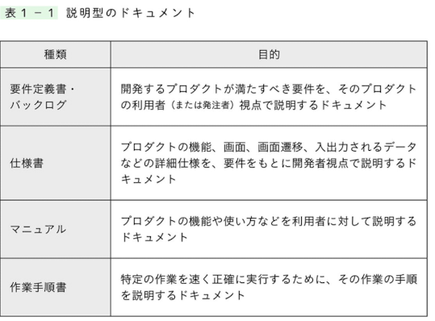
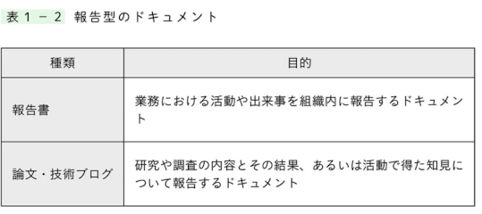
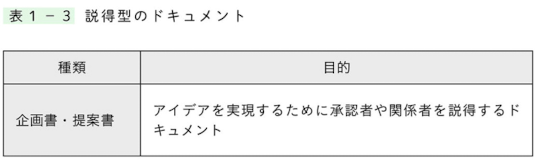
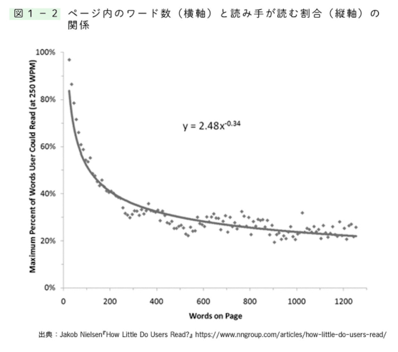

# ドキュメントの基本的な書き方

## 1.ドキュメントを書く目的
- 説明型：概念や手順を説明する
- 報告型：知見や活動を報告する
- 説得型：意見や提案を伝え相手の行動を促す

## 2.良いドキュメントの３つの要素

- 書き手と読み手の双方の目的を達成する事がドキュメントのゴール

- 良いドキュメントの要素は以下の通り。
  - 必要な情報を正しく得られること
  - 効率良く理解できること
  - 不快さがなく、ポジティブに受け止められること

## 3.効率良く理解できること
- 読み手はほとんど最後まで読んでくれません
- 人はページ内の２〜３割程度しか読まれない事が示される。

- 書き手として流し読みされる事を前提にして、それでも必要な情報が伝わるように書く努力が必要。

- 読み手が効率よく情報を得られるようにする為には以下のように工夫する。
  - 要点を先に伝える
  - どこを何が書いてあるかわかりやすくする
  - 話の流れを理解し、理解しやすくする
  - 簡潔でよみやすい文書でかく
  - 必要な情報だけを書く