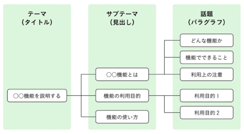
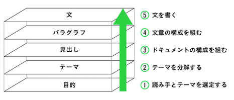
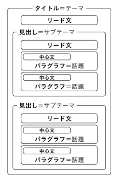
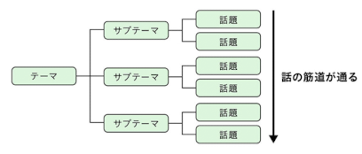
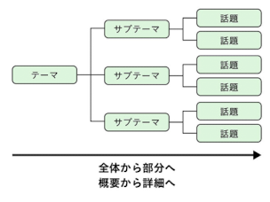
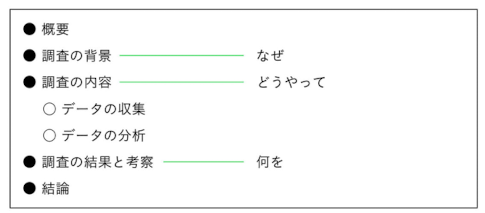

# ドキュメントの基本的な書き方

# 1.良いドキュメントを効率よく書くために
## ドキュメントを書く目的
- 説明型：概念や手順を説明する
- 報告型：知見や活動を報告する
- 説得型：意見や提案を伝え相手の行動を促す


## 良いドキュメントの３つの要素

- 書き手と読み手の双方の目的を達成する事がドキュメントのゴール

- 良いドキュメントの要素は以下の通り
  - 必要な情報を正しく得られること
  - 効率良く理解できること
  - 不快さがなく、ポジティブに受け止められること

## 効率良く理解できること
- 読み手はほとんど最後まで読んでくれません
- 人はページ内の２〜３割程度しか読まれない事が示される


- 書き手として流し読みされる事を前提にして、それでも必要な情報が伝わるように書く努力が必要。

- 読み手が効率よく情報を得られるようにする為には以下のように工夫する。
  - 要点を先に伝える
  - どこを何が書いてあるかわかりやすくする
  - 話の流れを理解し、理解しやすくする
  - 簡潔でよみやすい文書でかく
  - 必要な情報だけを書く

- 書くことプログラミングの共通要素
  - 最初の設計が大切
    - コードを書き始める前に行う設計の工程は欠かせない
    - 各見出しにサブテーマを割り当て、最終的にパラグラフまでに分解する
  - 内容を表した関数名(見出し)をつける
    - 書かれている内容がわかる見出しをつける
  - １つの関数に１つの役割を持たせる
    - １つの関数が複数の役割をもつと、プログラムの読みやすさやメンテナンスが低下する
    - ドキュメントも同様で１つの見出しに１つのテーマを持たせわかりやすくする必要がある
  - コードを共通化する
    - 共通のコードを持たせることでコード全体の整合性をもたせる。
    - ドキュメントも同様で共通する記述は１箇所にまとめるたり、参照リンクを貼る事が必要である

- 書く前にテーマを分解する
  - テーマを小さいサブテーマに切り分ける
  - 分解してできたサブテーマ毎に見出しを割り当てる
  - サブテーマ毎に文章を書く
  


- ドキュメントを書く際は５つのステップにわけて作りやすくする



# 2.ドキュメントの読み方を理解する

## 階層構造を理解する
- ドキュメントの階層構造を理解すると要点を掴みながら読める
- 本も同様で目次をみてから本書を読むと理解がしやすくなる

- ドキュメントの要素



# 3.読み手とテーマを選定

下記の事を工夫し読み手に合わせたドキュメントの作成が必要
- 読み手のレベル、誰に伝えたいのか
- 読み手に何を伝えたいのか
- 専門用語を使う頻度
- 用語の解説の有無

# 4.テーマを分解する

- 筋道を立てて読み手に伝える



- テーマを分解し、複雑な情報を整理して読み手に伝える
  - 全体から部分へ、概要から詳細へと段階を追って読み手に知識を付け加えていく



# 5.ドキュメントの骨組み（アウトライン）を組む
- ドキュメントとアウトラインは、章・節・項などの見出しを段階的に表示
- アウトラインと目次の違いは以下の通り
  - アウトライン：書き手がドキュメントの構成を組むためのもの
  - 目次：読み手がドキュメントの構成を掴むもの
- アウトラインは書き手にとっての設計図となる
- ドキュメントの基本的な構成：下記の図のように、「なぜ・何を・どうやって」の３つの要素で構成する
- 分解したテーマ毎にアウトラインを組んでいく
- 時系列を意識してアウトラインを組み立てる
- 「なぜ・何を・どうやって」の３つの要素の並び順を意識
  - 説明型ドキュメントの場合：「なぜ」→「何を」→「どうやって」と相手に共感を得るように組み立てる
  - 報告型ドキュメントの場合：「なぜ」→「どうやって」→「何を」と先に結論を出して組み立てる



# 6.ChatGPTで効率よくドキュメントを作成
- ドキュメントのプロセス・大枠が記載されたプロプトを作成し、ChatGPTに作成してもらう。

- 以下：プロンプト例

```
健康習慣支援システムに１日の歩数量データから可視化ができるグラフや歩数量データから健康アドバイスをする機能マニュアルを作成せいてください。

以下の情報を参考にドキュメントおよびアウトラインの作成をお願いします。

### 機能面
- 歩数量統計のダッシュボード

### 機能詳細
- １日の歩数量データから月次・週次集計や全国・社内平均の比較・アドバイスが確認できる
  - 利用者毎の歩数量データ収集機能
  - 歩数量の月次・週次集計機能
  - 歩数量データから「歩行・健康」に関する論文を学習した生成AIによる健康アドバイス

### 機能目的
- 歩数量のデータ収集から個人に合わせたアドバイスを行い健康へ意識を高める。

### 補足
- システムの主な言語はフロントエンドはReact、バックエンドはPythonで実装を考えています。
```

- 以上のプロンプトからChatGPTの回答
```md
# 健康習慣支援システム マニュアル

## 1. 概要
本システムは、1日の歩数量データを収集し、月次・週次集計や全国・社内平均との比較を行うことで、健康意識の向上を支援します。また、歩行・健康に関する論文を学習した生成AIが、個人のデータに基づいた健康アドバイスを提供します。

## 2. システム構成
- **フロントエンド**: React
- **バックエンド**: Python
- **データ管理**: 歩数量データの収集・分析
- **AIアドバイス**: 歩行・健康に関する論文を学習した生成AI

## 3. 主な機能
### 3.1. ダッシュボード
ダッシュボードでは以下の情報を確認できます。
- **当日の歩数**
- **週次・月次の歩数推移**
- **全国平均・社内平均との比較**
- **健康アドバイスの表示**

### 3.2. 歩数量データの収集
利用者はスマートフォンやウェアラブルデバイスから歩数データを自動で同期できます。データはリアルタイムで更新され、統計情報として蓄積されます。

### 3.3. 歩数量の月次・週次集計
収集したデータを基に、以下の集計が可能です。
- **週次集計**: 各曜日ごとの平均歩数を表示
- **月次集計**: 1ヶ月間の歩数推移を可視化
- **トレンド分析**: 過去データと比較し、歩行習慣の変化を把握

### 3.4. 健康アドバイス機能
生成AIが、以下の情報をもとに個人に合わせた健康アドバイスを提供します。
- **現在の歩数状況**
- **全国・社内平均との比較**
- **健康に関する最新論文の知見**

例:
> 「今週の平均歩数は全国平均より10%多いですが、社内平均より低いため、週末にもう少し歩くことを推奨します。」

## 4. 画面説明
### 4.1. ダッシュボード
![ダッシュボード画面イメージ]

ダッシュボードでは以下の情報を確認できます。
1. **今日の歩数**
2. **週次・月次のグラフ**
3. **全国・社内平均との比較**
4. **健康アドバイス表示エリア**

### 4.2. データ詳細画面
データの詳細画面では、個別の日付を選択して、詳細な歩行データや推移を確認できます。

## 5. 利用方法
### 5.1. 初期設定
1. システムにログイン
2. 歩数データを同期するデバイスを登録
3. 設定完了後、データの収集が開始されます

### 5.2. 日々の利用方法
1. ダッシュボードで歩数を確認
2. 週次・月次データの変化を分析
3. AIからのアドバイスを活用し、健康習慣を改善

## 6. まとめ
本システムを活用することで、日々の歩行データをもとに健康を意識し、継続的な運動習慣を身につけることが可能です。

```

- 以上のChatGPTから得られたドキュメントから情報を付け足す事によって作成効率が上がります。
- また社内独自のドキュメントフォーマットがある場合は事前にChatGPTに学習させる事でさらに作成効率が上がります。